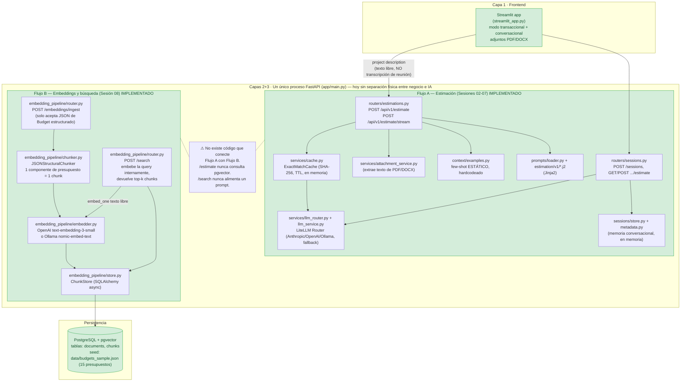
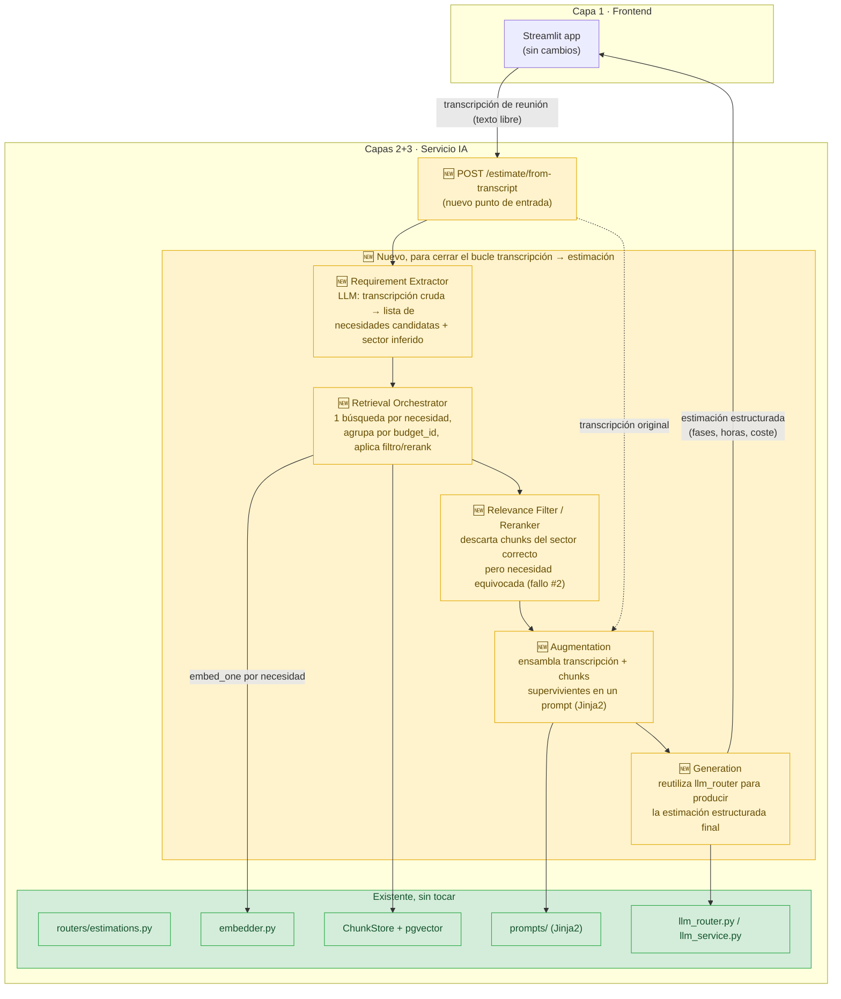

# Diagnóstico arquitectónico del sistema RAG actual

> **Nota sobre el material de partida.** El enunciado de este ejercicio asume un `TEMPLATE.md` y tres transcripciones en `examples/transcripts/` ya presentes en el repositorio. Ninguno de los dos existía al empezar. El repo sí tiene un `data/seed/transcripts/` con tres transcripciones, pero son de otro género (actas de seguimiento post-firma sobre presupuestos ya cerrados: altas de contacto, direcciones de facturación, addenda LOPDGDD) y su presupuesto asociado (`data/seed/budgets/BUDGET-2024-0005-v1.json`) usa un esquema incompatible con el `Budget` de `app/embedding_pipeline/schemas.py` (sin `sector`, sin `components`, sin `tech_stack`) — no son ingeribles por el pipeline actual. Por tanto, `examples/transcripts/01_clear.txt`, `02_ambiguous.txt` y `03_hard.txt` son de autoría propia para este ejercicio, escritas siguiendo la descripción del enunciado (cliente claro / cliente ambiguo / cliente que cambia de alcance). Este propio documento hace las veces de `TEMPLATE.md`, siguiendo el orden de secciones pedido.

## 1. Diagrama de la arquitectura actual

Al cierre de la Sesión 08 el sistema es, físicamente, **un único proceso FastAPI** (`app/main.py`) al que Streamlit llama por HTTP. Dentro de ese proceso conviven dos flujos que **no se comunican entre sí**: el de estimación transaccional/conversacional (Sesiones 02-07, basado en few-shot estático) y el de embeddings/búsqueda semántica (Sesión 08, basado en pgvector). Ambos se muestran como dos sub-flujos separados dentro de la misma capa de servicio IA para dejar explícito que hoy son islas.



**Dónde se queda corto el flujo si llega una transcripción hoy:** si alguien pega el texto de `02_ambiguous.txt` en el campo `project description` de `/api/v1/estimate`, el sistema lo trata como una descripción de proyecto ya limpia y se lo pasa tal cual al LLM junto con los 5 ejemplos few-shot **estáticos** de `context/examples.py` — nunca toca `pgvector`, nunca ve los 15 presupuestos históricos reales. Y si en su lugar se llama a `/search` con la transcripción, se obtienen chunks relevantes (ver Sección 2) pero ahí termina el flujo: no hay ninguna pieza que junte esos chunks con la transcripción y se los pase a un LLM para generar una estimación.

## 2. Trace anotado de una transcripción

Entorno: `docker compose up -d --build` (Postgres 16 + pgvector, servicio IA), migraciones aplicadas (`alembic upgrade head`, revisión `0001_initial_schema`), corpus de 15 presupuestos ya ingerido desde `data/budgets_sample.json` vía `scripts/query_examples.py` (idempotente: `0 ingeridos, 15 ya presentes`). `EMBEDDING_PROVIDER=ollama`, modelo `nomic-embed-text:latest` (768 dimensiones) servido en `curie.ita.es:11434`.

### 2.1 Embedding de la transcripción completa

No existe ningún endpoint HTTP que devuelva el vector de un texto arbitrario: `POST /embeddings/ingest` solo acepta un `Budget` estructurado y `POST /search` embebe la query internamente pero nunca la expone en la respuesta (`IngestResponse` documenta explícitamente que "los vectores ya no viajan por HTTP"). Para obtener el vector real llamo directamente al módulo de embeddings, dentro del contenedor del servicio:

```bash
docker compose exec -T ai_service python -c "
import sys, json, math
from app.embedding_pipeline.embedder import get_embedder
text = sys.stdin.read()
embedder = get_embedder()
vec = embedder.embed_one(text)
norm = math.sqrt(sum(x * x for x in vec))
print(json.dumps({'dimension': len(vec), 'first_component': vec[0], 'last_component': vec[-1], 'l2_norm': norm}, indent=2))
" < examples/transcripts/02_ambiguous.txt
```

Respuesta cruda:

```json
{
  "dimension": 768,
  "first_component": 0.014775986,
  "last_component": 0.0020134829,
  "l2_norm": 1.0000003672595883
}
```

**Comentario:** la transcripción completa (2.553 caracteres, mezcla de quejas sobre el software actual, turnos de fisios, competencia y, solo en dos frases, la necesidad real) se colapsa en un único vector de 768 componentes, normalizado a norma ≈1 (típico de `nomic-embed-text`, que normaliza L2 para que la distancia coseno se comporte bien). Ese vector representa el "centro de masa" semántico de **todo** el texto, no la necesidad concreta del cliente — no hay forma de saber, mirando el vector, cuánto peso relativo tuvo "quejas sobre facturación" frente a "quiero videollamada de seguimiento".

### 2.2 Búsqueda semántica con la transcripción

Uso `POST /search` pasando la transcripción completa como `query` (así es como está implementado en S08: el endpoint embebe internamente, no acepta un vector ya calculado):

```bash
curl -s -X POST http://localhost:8000/search \
  -H "Content-Type: application/json" \
  --data-binary @- <<'PAYLOAD' | python -m json.tool
{"query": "<contenido completo de examples/transcripts/02_ambiguous.txt>", "k": 5}
PAYLOAD
```

Respuesta cruda (`search_time_ms: 370`):

```json
{
  "k": 5,
  "results": [
    {
      "chunk_id": 32, "document_id": 9, "distance": 0.3860963854559235,
      "content": "[Project: Patient appointment and telemedicine platform with HL7/FHIR integration]\n[Client sector: healthcare | Year: 2024 | Main tech: python_django]\n\nComponent: Telemedicine video sessions\nDescription: WebRTC-based video consultation with waiting room, in-call notes and secure recording consent handling.\nTech stack: python_django, webrtc\nComplexity: high\nEstimated hours: 160",
      "metadata": {"budget_id": "BUD-2024-009", "component_id": "VIDEO-003", "client_sector": "healthcare", "main_technology": "python_django", "complexity": "high", "estimated_hours": 160, "year": 2024}
    },
    {
      "chunk_id": 30, "document_id": 9, "distance": 0.38712405580325493,
      "content": "[Project: Patient appointment and telemedicine platform with HL7/FHIR integration]\n[Client sector: healthcare | Year: 2024 | Main tech: python_django]\n\nComponent: FHIR integration layer\nDescription: HL7 FHIR R4 integration that maps internal patient and encounter records to the hospital EHR, with terminology mapping and audit logging.\nTech stack: python_django, postgresql\nComplexity: high\nEstimated hours: 190",
      "metadata": {"budget_id": "BUD-2024-009", "component_id": "FHIR-001", "client_sector": "healthcare", "main_technology": "python_django", "complexity": "high", "estimated_hours": 190, "year": 2024}
    },
    {
      "chunk_id": 31, "document_id": 9, "distance": 0.3950592433982538,
      "content": "[Project: Patient appointment and telemedicine platform with HL7/FHIR integration]\n[Client sector: healthcare | Year: 2024 | Main tech: python_django]\n\nComponent: Appointment scheduling\nDescription: Scheduling engine with clinician availability, resource booking, reminders and a waitlist for cancellations.\nTech stack: python_django, celery\nComplexity: medium\nEstimated hours: 150",
      "metadata": {"budget_id": "BUD-2024-009", "component_id": "APPT-002", "client_sector": "healthcare", "main_technology": "python_django", "complexity": "medium", "estimated_hours": 150, "year": 2024}
    },
    {
      "chunk_id": 33, "document_id": 9, "distance": 0.40069613431826534,
      "content": "[Project: Patient appointment and telemedicine platform with HL7/FHIR integration]\n[Client sector: healthcare | Year: 2024 | Main tech: python_django]\n\nComponent: Consent and audit module\nDescription: GDPR-aligned consent capture and immutable access audit trail for protected health information.\nTech stack: python_django, postgresql\nComplexity: low\nEstimated hours: 60",
      "metadata": {"budget_id": "BUD-2024-009", "component_id": "CONSENT-004", "client_sector": "healthcare", "main_technology": "python_django", "complexity": "low", "estimated_hours": 60, "year": 2024}
    },
    {
      "chunk_id": 37, "document_id": 11, "distance": 0.4507399587499379,
      "content": "[Project: Pharmacy inventory and prescription fulfillment system]\n[Client sector: healthcare | Year: 2023 | Main tech: java_spring]\n\nComponent: Prescription intake and validation\nDescription: Electronic prescription intake with drug-interaction checks, dosage validation and pharmacist review queue.\nTech stack: java_spring, postgresql\nComplexity: high\nEstimated hours: 170",
      "metadata": {"budget_id": "BUD-2024-011", "component_id": "RX-001", "client_sector": "healthcare", "main_technology": "java_spring", "complexity": "high", "estimated_hours": 170, "year": 2023}
    }
  ]
}
```

### 2.3 Comentario por chunk

| # | Presupuesto | Sector | ¿Relevante para el cliente de `02_ambiguous.txt`? |
| --- | --- | --- | --- |
| 1 | BUD-2024-009 (MediTrack) — Telemedicine video sessions | healthcare | **Sí, directamente.** Es exactamente la "consulta de seguimiento por videollamada" que pide Javier. |
| 2 | BUD-2024-009 (MediTrack) — FHIR integration layer | healthcare | **Parcialmente.** Relevante como pieza de integración con historiales clínicos, pero Clínica Row tiene historiales en Excel/papel, no un EHR con HL7/FHIR — este componente sobreestimaría la complejidad de esa parte si se usara tal cual. |
| 3 | BUD-2024-009 (MediTrack) — Appointment scheduling | healthcare | **Sí, directamente.** Es la reserva de cita desde el móvil que pide el cliente. |
| 4 | BUD-2024-009 (MediTrack) — Consent and audit module | healthcare | **Tangencial.** Tiene sentido como pieza de cumplimiento normativo, pero el cliente no lo pidió explícitamente; aparece por venir del mismo presupuesto, no porque el chunk en sí sea el más parecido a algo mencionado. |
| 5 | BUD-2024-011 (PharmaChain) — Prescription intake and validation | healthcare | **No.** Dispensación de recetas en farmacia no tiene relación con reservar citas o hacer seguimiento remoto de fisioterapia. Es un falso positivo que solo comparte sector y vocabulario genérico de salud ("patient", "clinical"). |

**Honestamente:** el resultado es mejor de lo que esperaba antes de correr el trace — 3 de 5 chunks son sólidamente relevantes y los 5 son al menos del sector correcto, seguramente porque el vocabulario sanitario domina léxicamente sobre el ruido administrativo de la transcripción. Pero el margen entre el mejor resultado (0.386) y el peor (0.451) es de solo 0.065 sobre una escala 0-2: las distancias están comprimidas y no hay ningún corte natural que separe "esto es relevante" de "esto solo comparte sector". El sistema no lo sabe distinguir; lo distingo yo, leyendo el contenido a mano.

## 3. Diagnóstico: cinco fallos identificados

**1. Toda la transcripción se embebe como un único vector, sin separar ruido de necesidad real.**
*Problema observado:* el vector de la Sección 2.1 representa por igual las quejas de facturación, la caída de turnos, la competencia y la única frase que realmente importa ("videollamada de seguimiento"). Solo salió bien porque el vocabulario sanitario domina; con una transcripción donde el "ruido" perteneciera a otro sector (p. ej. si Javier hablase largo y tendido de un problema de contabilidad interna antes de mencionar la clínica), el vector podría desplazarse hacia un sector equivocado.
*Causa probable:* no hay ninguna etapa entre "transcripción cruda" y "texto a embeber". El pipeline actual solo sabe embeber presupuestos estructurados (un chunk por componente) o strings ya limpios pasados a `/search`.
*Propuesta de solución:* una etapa de extracción de requisitos (LLM) que lea la transcripción cruda y devuelva una lista corta de necesidades candidatas, cada una embebida por separado, en vez de vectorizar el documento completo.

**2. Un chunk de otro dominio se cuela en el top-5 sin que nada lo detecte.**
*Problema observado:* el chunk 5 (RX-001, dispensación de recetas en farmacia) aparece con distancia 0.4507, dentro del rango comprimido de 0.065 respecto al mejor resultado, a pesar de no tener relación real con lo que pide el cliente.
*Causa probable:* `ChunkStore.search()` (`app/embedding_pipeline/store.py`) hace `ORDER BY distance LIMIT k` sin ningún umbral de corte ni verificación adicional de relevancia — cualquier chunk del mismo sector "arrastra" por cercanía léxica genérica.
*Propuesta de solución:* un paso de verificación/reranking posterior a la recuperación vectorial (LLM-as-judge o cross-encoder) antes de que un chunk llegue al prompt de generación.

**3. No existe ningún punto de entrada que reciba una transcripción y devuelva una estimación.**
*Problema observado:* para completar el trace tuve que llamar por un lado al módulo de embeddings directamente (no expuesto por HTTP) y por otro a `/search`; ninguna llamada HTTP existente hoy encadena las dos cosas, y ninguna toca el flujo de `/api/v1/estimate`.
*Causa probable:* `/embeddings/ingest` y `/search` se diseñaron en Sesión 08 como piezas de infraestructura para el smoke test (`scripts/query_examples.py`), no como servicio de cara al backend de negocio; `/api/v1/estimate` (Sesiones 02-07) se diseñó antes de que existiera `pgvector` y sigue usando exclusivamente los few-shot estáticos de `context/examples.py`.
*Propuesta de solución:* un endpoint (o servicio interno) de orquestación que encadene embedding de la transcripción → retrieval → augmentation → generación, en vez de dejar que quien lo consuma encadene piezas sueltas a mano.

**4. La búsqueda no diversifica: 4 de 5 resultados vienen del mismo presupuesto.**
*Problema observado:* de los 5 chunks devueltos, 4 pertenecen a `document_id=9` (BUD-2024-009). Da una base coherente si el objetivo es "encuentra el proyecto histórico más parecido", pero deja fuera cualquier otro presupuesto de salud (p. ej. CarePulse, con monitorización remota y alertas, muy pegado a "que alguien se entere si el dolor es muy alto") que podría aportar una pieza distinta a la estimación.
*Causa probable:* el `ORDER BY distance LIMIT k` no tiene ningún control de diversidad ni agrupación por `budget_id`.
*Propuesta de solución:* diversificación de resultados (tipo MMR) o agrupación explícita por presupuesto en la capa de retrieval, para que la estimación se apoye en varios proyectos comparables y no en las cuatro esquinas del mismo.

**5. No hay etapa de Augmentation ni de Generation: el flujo se detiene en una lista de chunks.**
*Problema observado:* la respuesta de `/search` es JSON con `chunk_id`, `content`, `distance` y `metadata` — nada construye con eso un prompt, y nada lo pasa a un LLM. No existe una estimación de horas/coste al final del camino.
*Causa probable:* Sesión 08 se detuvo deliberadamente en la persistencia y recuperación vectorial ("se construye en el directo", según el propio README); la infraestructura de prompts (`app/prompts/`, Jinja2) y de LLM (`app/services/llm_router.py`, `llm_service.py`) existe pero solo la usa el flujo de `/api/v1/estimate`, que no consume resultados de `/search`.
*Propuesta de solución:* dos etapas nuevas: Augmentation (ensambla transcripción + chunks recuperados en un prompt, reutilizando la infraestructura Jinja2 ya existente) y Generation (reutiliza `llm_router`/`llm_service` para producir la estimación estructurada final).

**Otros (no entre los cinco principales, pero observados):** la primera llamada a `/search` en `scripts/query_examples.py` tardó 4.478 ms frente a 138-1.125 ms de las siguientes — el servidor Ollama remoto (`curie.ita.es`) tiene un coste de arranque de modelo la primera vez que se usa en un rato, algo a tener en cuenta si la latencia del flujo end-to-end importa.

## 4. Propuesta de evolución arquitectónica



El **Requirement Extractor** separa señal de ruido antes de vectorizar nada (responde al fallo #1); el **Retrieval Orchestrator** convierte esas necesidades en varias búsquedas dirigidas contra `pgvector` en vez de una sola búsqueda con todo el texto, y agrupa por presupuesto para no quedarse con las cuatro esquinas del mismo proyecto (fallo #4); el **Relevance Filter** descarta chunks que comparten sector pero no necesidad real, como el de PharmaChain en el trace (fallo #2); **Augmentation** y **Generation** cierran el bucle reutilizando la infraestructura de prompts y de LLM que ya existe, en vez de duplicarla (fallo #3 y #5). El dato que fluye entre etapas es siempre texto estructurado: la transcripción cruda entra al Extractor y sale una lista de necesidades; esa lista entra al Orchestrator y salen chunks agrupados y filtrados; esos chunks entran a Augmentation junto con la transcripción original y sale un prompt; ese prompt entra a Generation y sale la estimación. Si solo pudiera construir una pieza, sería el **Requirement Extractor**: el trace de la Sección 2 muestra que incluso embebiendo el documento entero de mala manera el retrieval funcionó razonablemente por suerte de dominio — con una transcripción menos favorable (como `03_hard.txt`, que mezcla dos sectores sin cerrar alcance) esa suerte no está garantizada, y ninguna mejora en retrieval o generación compensa partir de un vector que no representa la necesidad real del cliente.
